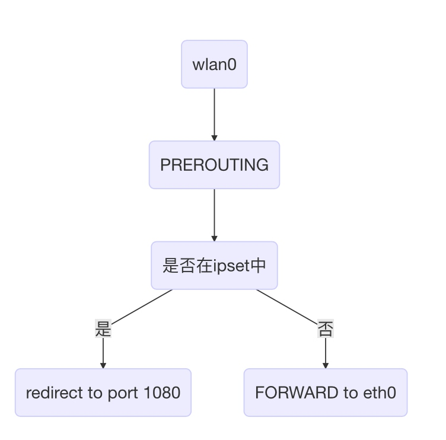

# 使用树莓派科学上网(shadowsocket版)
最近使用VPN科学上网有点问题，只能上shadowsocket了

## server
首先我们需要一个国外的服务器，可以是云主机或者是VPS，在上面安装shadowsocket

pip 安装的是python版，也可以安装C版本，不过需要自己编译。

```
sudo pip install shadowsocks
# 或者安装libev 版本的
sudo apt-get install build-essential autoconf libtool libssl-dev
git clone https://github.com/shadowsocks/shadowsocks-libev.git
cd shadowsocks-libev
./configure && make
make install
```
配置文件 /etc/shadowsocks.json
```json
{
"server":"0.0.0.0",
"server_port":9000,
"local_port":1080,
"password":"helloworld",
"timeout":600,
"method":"aes-256-cfb"
}
```

启动服务

```
sudo ssserver -c /etc/shadowsocks.json -d restart
sudo ssserver -d stop
```

## client
在树莓派上我们需要安装shadowsocket client
```
sudo apt-get install build-essential autoconf libtool libssl-dev
git clone https://github.com/shadowsocks/shadowsocks-libev.git
cd shadowsocks-libev
./configure && make
make install
```
配置文件和服务器端的配置文件相同，命令里面一定要加-b 0.0.0.0，不然连接wifi的其他设备无法科学上网。
```
nohup  ss-redir -v -c /etc/shadowsocks.json -b 0.0.0.0 &
```
添加iptables配置，我们使用了ipset，把无法访问的域名的流量redirect到本地的ss客户端。

```
sudo iptables -t nat -A POSTROUTING -o eth0 -j MASQUERADE  
sudo iptables -A FORWARD -i eth0 -o wlan0 -m state --state RELATED,ESTABLISHED -j ACCEPT  
sudo iptables -A FORWARD -i wlan0 -o eth0 -j ACCEPT
# 上面是我们已经添加过的了，把树莓派当做路由器
sudo ipset -N gfwlist iphash
sudo iptables -t nat -A PREROUTING -p tcp -m set --match-set gfwlist dst -j REDIRECT --to-port 1080
sudo iptables -t nat -A OUTPUT -p tcp -m set --match-set gfwlist dst -j REDIRECT --to-port 1080
```

### ipset配置
https://github.com/cokebar/gfwlist2dnsmasq

可以使用这个项目来生成dnsmasq_list.conf，然后复制到/etc/dnsmasq.d/下

这个里面把无法访问的域名都放到ipset里面了

### iptables 原理解释
在PREROUTING的时候就会判断ipset，所以ss-redir一定要绑定0.0.0.0，否则ss只会转发从本地(127.0.0.1)的流量，会出现在树莓派上可以科学上网，连接wifi的设备无法科学上网。



参考：
https://cokebar.info/archives/962
https://gist.github.com/wen-long/8644243
https://shadowsocks.org/en/download/servers.html
https://www.linuxbabe.com/linux-server/setup-your-own-shadowsocks-server-on-debian-ubuntu-centos
http://www.thegeekstuff.com/2011/01/iptables-fundamentals/

