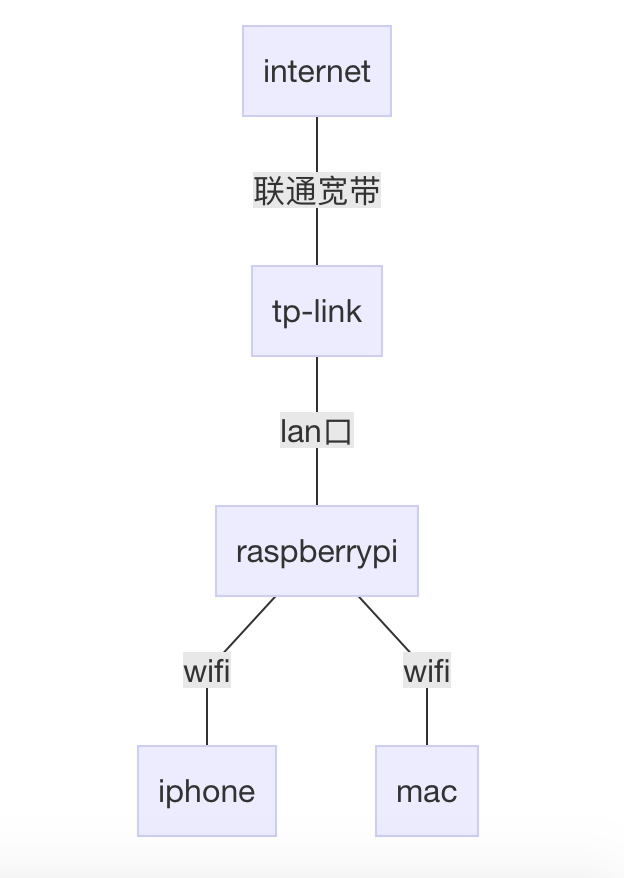

# 把树莓派当做无线路由器

最新的Raspberry Pi 3开发板上提供了wifi模块，我在想是不是有可能把树莓派当做一个无线路由器使用？最后发现其实很简单，因为板载的BCM43438 芯片是有开源驱动的(brcmfmac)，如果安装最新的raspbian，默认驱动已经安装好了，最麻烦的驱动问题迎刃而解。

## OS环境
安装最新的raspbian，相当于debian 8 jessie arm版本，安装的过程不再赘述。
```
RASPBIAN JESSIE
Full desktop image based on Debian Jessie
Version:May 2016
Release date:2016-05-27
Kernel version:4.4
```
## 网络环境



用网线把树莓派和tp-link的lan口连接起来，然后在tp-link的设置当中，IP与MAC绑定设置，把树莓派的IP地址固定为一个地址，我设置的是192.168.0.101。

## 软件包
```
sudo apt-get install hostapd dnsmasq
```
简单说明一下这两个包的功能：
* hostapd - 一个用户态用于AP和认证服务器的守护进程。它实现了IEEE 802.11相关的接入管理，IEEE 802.1X/WPA/WPA2/EAP 认证, RADIUS客户端，EAP服务器和RADIUS 认证服务器。
* dnsmasq - 作为DNS和DHCP服务器

dnsmasq也可以用其他软件包替代，比如bind9，isc-dhcp-server作为DNS和DHCP服务。不过dnsmasq
可以满足当前的需求，如果你有更复杂的需求，可以配置其他的服务。

## 软件配置
环境我们都准备好了，软件包已经安装，最重要的过程是软件的配置。

### wlan0 interface
第一步给wlan0配置一个静态IP。在最新的Raspian，wlan0默认配置在`dhcpcd`中，我们需要让`dhcpcd`忽略wlan0，`sudo vi /etc/dhcpcd.conf`，在文件的最后加上。
```
denyinterfaces wlan0  
```
下面我们给wlan0配置一个静态IP，`sudo vi /etc/network/interfaces`，把wlan0的那一段修改为：
```
allow-hotplug wlan0  
iface wlan0 inet static  
    address 172.24.1.1
    netmask 255.255.255.0
    network 172.24.1.0
    broadcast 172.24.1.255
#    wpa-conf /etc/wpa_supplicant/wpa_supplicant.conf
```
重启dhcpcd `sudo service dhcpcd restart`

使静态IP生效`sudo ifdown wlan0; sudo ifup wlan0`
### hostapd
新增配置文件`sudo vi /etc/hostapd/hostapd.conf`

```
# This is the name of the WiFi interface we configured above
interface=wlan0

# Use the nl80211 driver with the brcmfmac driver
driver=nl80211

# This is the name of the network
ssid=Pi3-AP

# Use the 2.4GHz band
hw_mode=g

# Use channel 6
channel=6

# Enable 802.11n
ieee80211n=1

# Enable WMM
wmm_enabled=1

# Enable 40MHz channels with 20ns guard interval
ht_capab=[HT40][SHORT-GI-20][DSSS_CCK-40]

# Accept all MAC addresses
macaddr_acl=0

# Use WPA authentication
auth_algs=1

# Require clients to know the network name
ignore_broadcast_ssid=0

# Use WPA2
wpa=2

# Use a pre-shared key
wpa_key_mgmt=WPA-PSK

# The network passphrase
wpa_passphrase=raspberry

# Use AES, instead of TKIP
rsn_pairwise=CCMP
```
我们可以测试一下`sudo /usr/sbin/hostapd /etc/hostapd/hostapd.conf`，现在你可以在手机上搜到Pi3-AP的wifi，输入密码连接上之后会发现一直等待的状态，因为DHCP服务还没配置，我们下一步就要配置dnsmasq。

#### 添加系统服务
安装hostapd之后，系统服务已经添加了，但是配置文件的地址还需要配置一下`sudo vi /etc/default/hostapd`，把`#DAEMON_CONF=""` 修改为
```
DAEMON_CONF="/etc/hostapd/hostapd.conf"
```
以后可以使用service来启动和停止hostapd

### dnsmasq
默认的配置包含大量的信息，但是我们用到的并不多，建议重命名，然后新建一个配置文件
```
sudo mv /etc/dnsmasq.conf /etc/dnsmasq.conf.orig
sudo vi /etc/dnsmasq.conf
```
把下面的内容粘贴进去
```
interface=wlan0      # Use interface wlan0  
listen-address=172.24.1.1 # Explicitly specify the address to listen on  
bind-interfaces      # Bind to the interface to make sure we aren't sending things elsewhere  
server=8.8.8.8       # Forward DNS requests to Google DNS  
domain-needed        # Don't forward short names  
bogus-priv           # Never forward addresses in the non-routed address spaces.  
dhcp-range=172.24.1.50,172.24.1.150,12h # Assign IP addresses between 172.24.1.50 and 172.24.1.150 with a 12 hour lease time  
```
### iptables
打开ip 转发 ，在配置文件当中`/etc/sysctl.conf`修改 `net.ipv4.ip_forward = 1`，然后输入`sudo sysctl -p` 使配置立刻生效
使用wifi共享internet，我们需要配置nat。iptables的功能非常强大，输入下面的命令：
```
sudo iptables -t nat -A POSTROUTING -o eth0 -j MASQUERADE  
sudo iptables -A FORWARD -i eth0 -o wlan0 -m state --state RELATED,ESTABLISHED -j ACCEPT  
sudo iptables -A FORWARD -i wlan0 -o eth0 -j ACCEPT  
```
#### iptables save and restore
每次重启之后iptables的配置都会丢失，所以需要保存一下
```
sudo sh -c "iptables-save > /etc/iptables.ipv4.nat"
sudo iptables-restore < /etc/iptables.ipv4.nat
```
你可以把restore步骤放到`/etc/rc.local`，每次重启都会自动restore
## 最后一步
最后一步，启动服务，你的设备就可以连接Pi3-AP就可以上网了。
```
sudo service hostapd start  
sudo service dnsmasq start 
```

参考资料
1. [USING YOUR NEW RASPBERRY PI 3 AS A WIFI ACCESS POINT WITH HOSTAPD](https://frillip.com/using-your-raspberry-pi-3-as-a-wifi-access-point-with-hostapd/)
